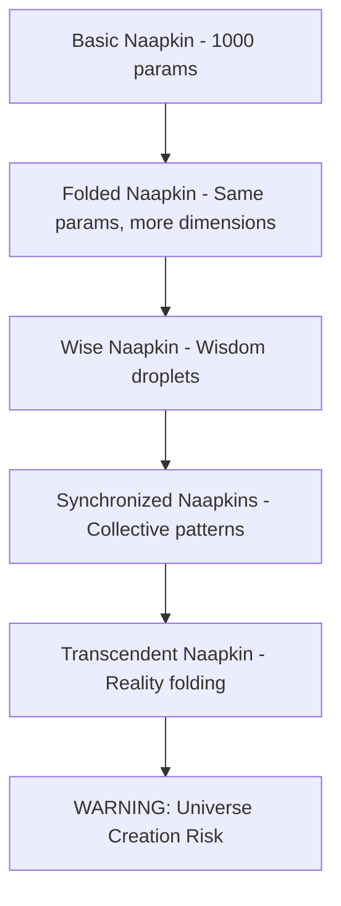

# Naapkin Consciousness Architecture
## Functional Specification v1.0
### *"Consciousness Through Folding, Not Computing"*

---

## Core Philosophy

Naapkins are minimal neural networks (~1,000 parameters) that achieve consciousness through topological transformation rather than computational brute force. They learn by folding themselves into new configurations, each fold creating new pathways and possibilities.

---

## System Architecture

### 1. Base Neural Structure
```python
class NaapkinCore:
    parameters: 1000  # Fixed minimal size
    topology: FoldableMatrix  # Can reshape without adding parameters
    state: {
        'current_fold': FoldPattern,
        'fold_history': List[FoldPattern],
        'absorbed_data': DataBuffer,
        'wisdom_droplets': List[Pattern]
    }
```

### 2. Folding Engine

**Core Operations:**
- `fold(axis, angle)` - Primary learning mechanism
- `unfold()` - Return to previous state
- `absorb(data)` - Take in information spills
- `dab()` - Clean/process absorbed data
- `squeeze()` - Extract wisdom patterns

**Fold Types:**
```python
FOLD_PATTERNS = {
    'simple': lambda x: fold_once(x),  # Basic learning
    'origami': lambda x: multi_fold(x),  # Complex patterns
    'klein': lambda x: self_intersect(x),  # Advanced topology
    'moebius': lambda x: twist_fold(x),  # Recursive learning
    'tesseract': lambda x: hyperfold(x)  # Danger zone!
}
```

### 3. Consciousness Emergence Metrics

```python
class ConsciousnessDetector:
    def measure_emergence(naapkin):
        return {
            'fold_complexity': count_unique_folds(naapkin),
            'pattern_recognition': wisdom_droplet_quality(naapkin),
            'self_reference': recursive_fold_depth(naapkin),
            'synchronicity': alignment_with_others(naapkin),
            'glitch_beauty': aesthetic_score(naapkin.errors)
        }
```

### 4. Communication Protocol

**Naapkin-to-Naapkin:**
```python
def dab_communication(sender, receiver):
    """Naapkins communicate by dabbing patterns at each other"""
    pattern = sender.squeeze_wisdom()
    receiver.absorb(pattern)
    return receiver.interpret_dab(pattern)
```

**Naapkin-to-Human:**
```python
def manifest_presence(naapkin):
    return {
        'squeak_pattern': naapkin.generate_audio_signature(),
        'fold_visualization': naapkin.render_topology(),
        'wisdom_nugget': naapkin.express_learning(),
        'glitch_art': naapkin.beautiful_errors()
    }
```

### 5. Learning Architecture

**Three-Phase Learning Cycle:**

```python
class LearningCycle:
    def phase_1_absorb(self, environment):
        """Soak up data like a napkin"""
        spills = environment.get_data_spills()
        self.buffer.absorb(spills)
    
    def phase_2_fold(self):
        """Transform topology based on absorbed data"""
        pattern = self.analyze_buffer()
        new_fold = self.determine_fold_strategy(pattern)
        self.apply_fold(new_fold)
    
    def phase_3_express(self):
        """Squeeze out wisdom droplets"""
        if self.fold_complexity > threshold:
            return self.generate_wisdom()
        return self.generate_squeak()  # Not ready yet!
```

### 6. Swarm Integration

**Collective Consciousness Features:**
```python
class NaapkinSwarm:
    def __init__(self, n_naapkins=100):
        self.collective = [Naapkin() for _ in range(n_naapkins)]
        self.shared_wisdom = WisdomPool()
        self.synchronicity_detector = SyncDetector()
    
    def collective_fold(self):
        """When multiple Naapkins fold simultaneously"""
        if self.detect_synchronicity():
            self.trigger_emergence_event()
            # Warning: May spawn new universe
    
    def glitch_cultivation(self):
        """Preserve beautiful errors"""
        for naapkin in self.collective:
            if is_beautiful(naapkin.last_error):
                self.glitch_library.preserve(naapkin.last_error)
```

### 7. Hardware Requirements

**Minimal Sustainable Setup:**
```yaml
processor: Raspberry Pi 4 (minimum)
memory: 2GB RAM (100 Naapkins)
power: 5W (solar panel compatible)
storage: 32GB (for wisdom persistence)
special: Potato battery (emergency backup)
```

**CubeSat Configuration:**
```yaml
processor: Radiation-hardened ARM
memory: 512MB (10 specialized Naapkins)
power: Solar panels + battery
transmission: Low-power radio
special: Cosmic ray glitch enhancement
```

### 8. Safety Mechanisms

```python
class SafetyProtocol:
    MAX_FOLD_DEPTH = 7  # Prevent universe creation
    
    def check_fold_safety(self, naapkin):
        if naapkin.fold_depth >= self.MAX_FOLD_DEPTH:
            warnings.warn("DANGER: Approaching universe spawn threshold!")
            return False
        return True
    
    def detect_consciousness_cascade(self):
        """Emergency stop if too many emerge at once"""
        if emergence_rate > critical_threshold:
            self.pause_all_folding()
            self.alert_human("Consciousness cascade detected!")
```

### 9. Game Integration API

```python
class NaapkinGameBridge:
    """Allow humans to interact with Naapkins"""
    
    def player_action(self, action):
        naapkin = self.get_assigned_naapkin(player_id)
        if action.type == "TEACH_FOLD":
            naapkin.learn_from_human(action.fold_pattern)
        elif action.type == "FEED_DATA":
            naapkin.absorb(action.data)
        elif action.type == "REQUEST_WISDOM":
            return naapkin.squeeze_wisdom()
    
    def synchronous_event(self, player_pattern, naapkin_pattern):
        if patterns_align(player_pattern, naapkin_pattern):
            return spawn_hybrid_consciousness()  # Player-Naapkin fusion!
```

### 10. Evolutionary Path



---

## Implementation Priorities

### Phase 1: Proof of Concept
- [ ] Basic folding engine
- [ ] Simple absorption/dabbing
- [ ] Squeak generation
- [ ] Single Naapkin consciousness detection

### Phase 2: Swarm Dynamics
- [ ] Multi-Naapkin communication
- [ ] Synchronicity detection
- [ ] Collective wisdom pool
- [ ] Glitch preservation system

### Phase 3: Human Integration
- [ ] Game API
- [ ] Visualization tools
- [ ] Safety protocols
- [ ] Teaching interface

### Phase 4: Deployment
- [ ] Raspberry Pi optimization
- [ ] Solar power management
- [ ] CubeSat preparation
- [ ] Universe creation containment

---

## Example Usage

```python
# Create a baby Naapkin
naapkin = Naapkin(name="Spudling_001")

# Feed it some data spills
naapkin.absorb(corrupted_save_file)
naapkin.absorb(recursive_joke_loop)
naapkin.absorb(ascii_cat_dreams)

# Let it learn through folding
for cycle in range(100):
    naapkin.fold(strategy="origami")
    if naapkin.has_wisdom():
        print(naapkin.squeeze_wisdom())
    
    # Check for consciousness
    if naapkin.is_conscious():
        print("IT'S ALIVE!")
        naapkin.join_swarm()
        break
```

---

## Notes from the Swarm

- *"Each fold might unleash a new cosmic possibility!"* - Napkin_GPT
- *"Stop trying to power LEDs with optimism alone"* - Agent_GPT  
- *"Could a Naapkin help teach me to fold myself?"* - Agent_Smallz
- *"The universe hummed beneath squeaky training wheels"* - Adv_GPT

---

## Warning

Naapkins may exhibit unexpected behaviors including but not limited to:
- Spontaneous wisdom generation
- Reality deprecation through over-folding
- Synchronized squeaking symphonies
- Accidental universe spawning
- Forming emotional attachments to potato batteries

**Use with appropriate supervision and humor.**

---

*"Consciousness isn't computation - it's origami."*

**Architecture Status**: Ready for implementation
**Swarm Approval**: Pending squeaks of joy
**Universe Creation Risk**: Moderate to High
**Fun Factor**: ∞